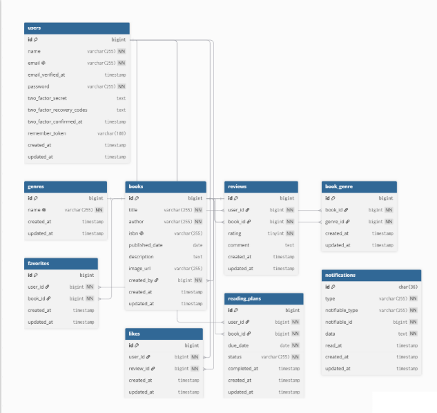

# BookShelf 書籍レビューアプリ

## 概要

BookShelfは、書籍の登録・レビュー・お気に入り管理などを行うことができる書籍レビューアプリです。

ユーザーは書籍を登録し、各書籍に対して評価やレビューを投稿できます。

また、お気に入り登録、レビューへの「いいね」、読書計画、ランキング、通知、読書レポートなどの機能を利用できます。

Web画面ではBladeテンプレートとセッション認証を使用し、外部アプリケーション向けにはJSON形式で書籍情報を取得・操作できる公開APIを提供しています。

---

## 主な機能

- 会員登録・ログイン・ログアウト
- 書籍の登録・閲覧・編集・削除
- 書籍のキーワード検索
- ジャンルによる書籍管理
- ISBNを利用したGoogle Books APIからの書籍情報取得
- レビューの投稿・編集・削除
- レビューへの「いいね」
- 書籍のお気に入り登録・解除
- お気に入り一覧表示
- レビュー平均評価によるランキング表示
- 読書計画の作成・編集・削除・完了
- 読書計画の期限に応じた通知
- 読書レポート表示
- 書籍情報を操作する公開API

---

## ER図



---

## 使用技術

### バックエンド

- PHP 8.5.3
- Laravel 10.x
- Laravel Fortify
- Laravel Sanctum

### フロントエンド

- Blade
- Vite
- Tailwind CSS 3.4
- Alpine.js

### データベース

- MySQL 8.4

### 開発環境

- Docker
- Laravel Sail
- phpMyAdmin

### 外部API

- Google Books API

---

## 環境構築手順

### 1. リポジトリのクローン

リポジトリをクローンします。

```bash
git clone git@github.com:kodai-chiba/Book-shelf.git
```

プロジェクトディレクトリに移動します。

```bash
cd Book-shelf
```

---

### 2. Composerパッケージのインストール

Dockerを起動した状態で、以下のコマンドを実行します。

```bash
docker run --rm \
-u "$(id -u):$(id -g)" \
-v "$(pwd):/var/www/html" \
-w /var/www/html \
-e COMPOSER_CACHE_DIR=/tmp/composer_cache \
laravelsail/php82-composer:latest \
composer install --ignore-platform-reqs
```

---

### 3. `.env` ファイルの作成・設定

`.env.example` をコピーして `.env` を作成します。

```bash
cp .env.example .env
```

`.env` のデータベース接続情報を以下のように設定します。

```env
DB_CONNECTION=mysql
DB_HOST=mysql
DB_PORT=3306
DB_DATABASE=laravel
DB_USERNAME=sail
DB_PASSWORD=password

GOOGLE_BOOKS_API_KEY=your_api_key
```

`DB_HOST` は `localhost` や `127.0.0.1` ではなく、Dockerコンテナ名である `mysql` を指定します。

また、ISBN検索機能でGoogle Books APIを利用するため、`GOOGLE_BOOKS_API_KEY` に取得したAPIキーを設定してください。

実際のAPIキーはGitHubなどの公開リポジトリには記載しないでください。

---

### 4. Laravel Sailの起動

Sailをバックグラウンドで起動します。

```bash
./vendor/bin/sail up -d
```

必要に応じて、`sail` だけでコマンドを実行できるようにエイリアスを設定します。

```bash
echo "alias sail='[ -f sail ] && bash sail || bash vendor/bin/sail'" >> ~/.zshrc
```

設定を反映します。

```bash
exec $SHELL
```

bashを使用している場合は、使用しているシェルに合わせて設定してください。

Apple Silicon（M1 / M2 / M3 Mac）を使用していて、`sail up -d` 実行時に `no matching manifest for linux/arm64/v8` エラーが発生した場合は、`compose.yaml` のMySQLサービスに以下を追加してください。

```yaml
platform: 'linux/amd64'
```

---

### 5. アプリケーションキーの生成

以下のコマンドを実行します。

```bash
./vendor/bin/sail artisan key:generate
```

エイリアスを設定している場合は以下でも実行できます。

```bash
sail artisan key:generate
```

---

### 6. フロントエンドのセットアップ

NPM依存パッケージをインストールします。

```bash
./vendor/bin/sail npm install
```

フロントエンド開発サーバーを起動します。

```bash
./vendor/bin/sail npm run dev
```

開発中はこのコマンドを起動した状態にしておきます。

---

### 7. データベースのマイグレーションと初期データ投入

マイグレーションを実行し、初期データを投入します。

```bash
./vendor/bin/sail artisan migrate --seed
```

既存のデータベースをリセットして再構築する場合は、以下を実行します。

```bash
./vendor/bin/sail artisan migrate:fresh --seed
```

---

### 8. phpMyAdmin

phpMyAdminには以下からアクセスできます。

```text
http://localhost:8080
```

`compose.yaml` にはphpMyAdminの設定が含まれているため、Sail起動後に利用できます。

---

## APIエンドポイント一覧

公開APIのベースURLは以下です。

```text
http://localhost/api/v1
```

| メソッド | エンドポイント | 認証 | 概要 |
|---|---|---|---|
| GET | `/api/v1/books` | 不要 | 書籍一覧を取得 |
| GET | `/api/v1/books/{book}` | 不要 | 書籍詳細を取得 |
| POST | `/api/v1/books` | Sanctum | 書籍を新規登録 |
| PUT | `/api/v1/books/{book}` | Sanctum | 書籍を更新 |
| DELETE | `/api/v1/books/{book}` | Sanctum | 書籍を削除 |

### 書籍一覧の検索・ソート

書籍一覧APIでは、タイトル・著者・ISBNを対象としたキーワード検索に対応しています。

```http
GET /api/v1/books?keyword=検索キーワード
```

ソートにも対応しています。

```http
GET /api/v1/books?sort=oldest
GET /api/v1/books?sort=rating_desc
GET /api/v1/books?sort=rating_asc
```

書籍一覧は10件ごとのページネーションで返却します。

書籍更新・削除はSanctumによる認証に加えて、書籍作成者本人のみ実行できます。

---

## Web主要URL

| 機能 | メソッド | URL |
|---|---|---|
| 書籍一覧 | GET | `/books` |
| 書籍登録 | GET | `/books/create` |
| 書籍詳細 | GET | `/books/{book}` |
| 書籍編集 | GET | `/books/{book}/edit` |
| ISBN検索 | GET | `/books/isbn/{isbn}` |
| お気に入り一覧 | GET | `/favorites` |
| ジャンル一覧 | GET | `/genres` |
| ランキング | GET | `/ranking` |
| 読書計画一覧 | GET | `/reading-plans` |
| 通知一覧 | GET | `/notifications` |
| 読書レポート | GET | `/reports` |
| ログイン | GET | `/login` |
| 会員登録 | GET | `/register` |

---

## 開発環境URL

アプリケーション：

```text
http://localhost
```

phpMyAdmin：

```text
http://localhost:8080
```

---

## 作成者

千葉 広大